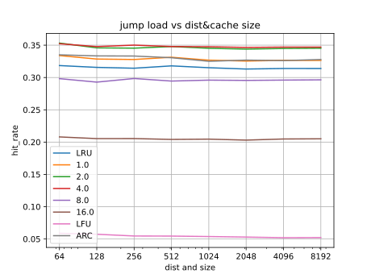
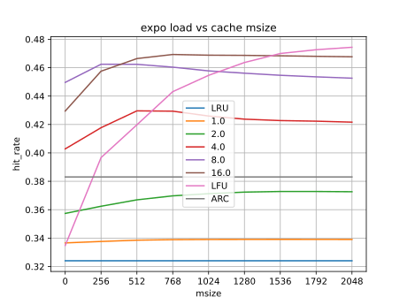
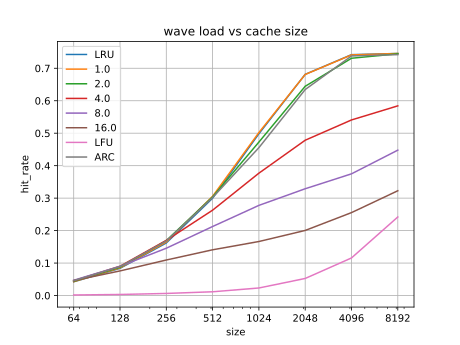
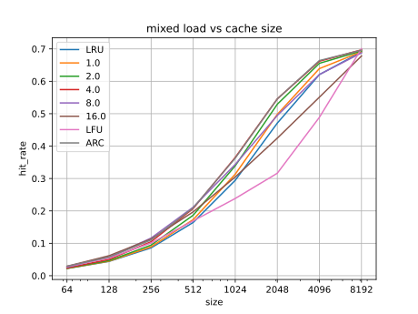

=============================
DLFUCache Performance Results
=============================

Testing
=======

Testing cache performance can be done using real-world usage tests, or
synthetic simulation tests. Real-world tests have the advantage of
being representative of the particular real-world use-case, but can be
unrepresentative of other real-world use-cases and are much harder to
analyse. Synthetic tests can specifically target known corner-cases
and are much easier to analyse, making it possible to more accurately
assess the performance and make comparisons.

Tests need to use access patterns with a range larger than the cache
size, otherwise the cache just fills with all the accessed entries and
the cache expiry policy is not exercised. Synthetic access patterns
should use working sets/ranges sized as multiples of the cache size.
In order to make variations in performance easy to see and to measure
the cache expiry policy, the access pattern size should be chosen to
give hitrates around the 50% mark. This is the point where a cache is
being stressed, but still functioning.

We use the following syntetic access patterns for doing cache
performance testing, using access pattern ranges that are scaled
relative to the cache size.

expo
----

This is random access using an exponential distribution. This
represents a typical task with a working set of entries that are of
varying popularity.

The settings are the median and an optional offset (used for "jump"
below). The median setting gives the size of the working set, where
50% of all accesses will be in the range 0 -> median (before applying
offset). So setting median to the cache size means the best possible
hitrate will be 50%.

This access pattern should strongly favour LFU caches, where long-term
past access history is the best hint of future access patterns.

Note in real-world workloads similar to this the access pattern will
not be a neat exponential distribution, and the most popular entries
will not be at the start of the access range but will be scattered.
However, if you sort the entries by popularity they will have a
distribution similar to an exponential distribution, and for caches
the ordering of the entries is not important, so this is fairly
representative of these kinds of workload.

walk
----

This is a random stochastic walk using a normal distribution. This
represents the idealistic case of a task wandering through data in a
way where locality is the only thing that matters. The walk "wraps
around" past the min and max values for the entry range (default:
minv=0, maxv=MAXK).

The settings are the variance and an optional start value (default:
start=MAXK/2). The variance affects how fast/far the walk will wander.
There is a one-sigma (68%) chance that it wanders less than
sqrt(variance*N) distance every N iterations. So setting the variance
to the cache size means there is a one-sigma chance (68%) it wanders
less than cache-size distance every cache-size number of accesses. In
practice using a variance of 2*N seems to produce a best-possible
hitrate of 50%

This access pattern should strongly favour LRU caches, where
short-term past access history is the best hint for future access
patterns.

wave
----

After looking at the results for walk more closely, it became apparent that it
was too random. The walk will hover around some values for a while, then
suddenly zoom off to other values, then drift, etc. This makes the cache
performance metrics vary wildly depending on the sample time and random seed,
making the results not very repeatable. This makes it difficult to analyse the
impact of changing cache parameters. A more predictable pattern that favours
LRU was needed.

This uses a reverse exponential distribution "wave" that constantly sweeps
forwards, so new entries are hit regularly at the wave's leading edge, but
then taper away on the wave's tail as it moves past. Like walk, the wave
"wraps around" past the min and max values for the entry range (default:
minv=0, maxv=MAXK). The settings are the expo wave's median, and the scan
sweep's step (default: 1/4).

The theoretical max hit rate for caches much larger than the expo median is
dependent on the scan step. With step=1/4, after 4x the wave's width worth of
fetches the wave has fully moved past, so each entry will get fetched an
average of 4 times, and the first must be a miss, for a 75% hit rate. When the
cache size is small relative to the expo median, the hit rate will be less
because not all of the wave fits in the cache. With median=size/2 the best hit
rate is about 50%.

jump
----

This is a random access using an exponential distribution that
periodically "jumps" to a new location. This represents running
different tasks with different working sets sequentially.

The settings are the expo distribution's median and optional interval,
start and step median multipliers for the jumping expo distribution's
jump interval and offset (defaults: interval=16, start=0.0, step=4.0).
The default interval means jumps happen every 16x the median accesses.
The default step means that each jump has very little overlap with the
previous jump at the tail end of its distribution.

This access pattern should favour a mixture of LFU and LRU, with LFU
working well between jumps, but LRU working better immediately after
each jump. Setting the median to the cache size N gives a best case
theoretical hitrate of around 50%*(interval - 2)/interval or default
43%. This assumes it takes 4*N accesses to repopulate the cache and
ramp up to a full theoretical 50% expo hitrate after every jump.

scan
----

This is a linear scan walking through all entries. This is completely
uncachable, and is mainly of interest for testing how badly caching
algorithms are hurt by this access pattern.

There are optional settings for the start and step (default: start=0,
step=1), and it will wrap around between min and max values (default:
minv=0, maxv=MAXK). The defaults mean it will not wrap within the test
timescales used.

This access pattern is known to cause problems for LRU, and LFU does a
much better job of ignoring these accessess.

mixed
-----

A mixture of expo, jump, wave, and scan patterns running at the same time.
This represents a long-running background task with a working set, a sequence
of short-running tasks with different working sets, a long-running task
sweeping across memory, and a long-running scan, all running at once.

The only setting is the size, used to set the median and variance of the expo,
jump, and wave patterns.

The best possible theoritical hitrate assuming 1/4 of the cache is used for
each load pattern is about (50% + 43% + 50% + 0%) / 4 = 36%. However, caches
that successfully ignore the scan and use 1/3 of the cache each for the other
load patterns could in theory do better than this.

Results
=======

For each test we have the following variables;

* load: the load type
* size: The cache size
* msize: The cache extra metadata msize
* T: the cache type and/or the T timeconstant, LRU/LFU/ARC/T
* dist: The load distribution spread value.
* C: The number of iterations

Note that for the jump load, the default jump interval is 16x the load
dist, so the number of iterations C must be a number of multiples of
16 to get multiple jumps in. We use C = 128*dist for 8 jumps, though
maybe more would be better.

How loads vary with size
------------------------

This measures how the hitrate varies if the load spread, cache size,
and number of iterations are scaled together. This should show that
hitrate is relatively constant for each load type when D and C is a
multiple of N. This property means tests for relatively small cache
sizes and load distributions are a good prediction for larger sizes.

We use size = msize = dist, and scale size between 64 to 2048.

.. image:: load-expo.svg

.. image:: load-walk.svg

These show that the loads are pretty stable as the test size is scaled,
particularly for sizes greater than 512. The expo, wave, jump, and
consequently mixed loads are very stable, with walk being more visibly
unstable because of its unpredictable behaviour.

There are also hints that LFU performance is more unstable, with the
"early hit luck" during the warmup phase having a big affect on the
overall result.

These graphs also show how DLFU performs for different T compared to
LFU/LRU/ARC.

How cache performance varies with msize
---------------------------------------

This measures how the hitrate varies when the extra metadata msize is
scaled. In theory extra metadata should improve caches that depend on
longer history, as it means entries that are displaced from the cache
early can retain and accumulate enough history to stick in the cache.

We use size = dist and vary msize between 0~2x size.

The expo and jump graphs clearly show that increasing msize improves
cache performance, particularly with large T values. Interestingly
just adding metadata to LFU significantly improves its performance,
peaking at better than all other caches for expo when msize = 2xsize.

The walk and wave graphs shows that for large T adding metadata initially
makes it worse, as expected from adding more history information for a load
pattern that doesn't depend on history. Interestingly it gets better as the
metadata size increases, suggesting that with enough history the cache "sees"
that the history is meaningless.

The mixed graph shows that adding metadata also improves things for
large T, but not as much due to the wave effects.

Overall, setting msize = size seems to be the sweet spot for best
results vs overheads, with diminishing returns for adding more.

Interestingly ARC caches also have 2x as much metadata as the cache
size. These results suggest that much of the benefits of ARC might
be because of the extra metadata, and not just it's adaptiveness.

How cache performance varies with size
--------------------------------------

This measures how caches perform for a fixed load dist as a function
of cache size.

We use dist = 1024 and msize=size, varying size between 64 to 8192.

The most interesting thing here is how performance for the jump load
varies with size. For small sizes T=8.0 is best, but as sizes increase
the lower T values start to win, with eventually LRU winning. This is
because the actual decay timeconstant is size*T, so as the cache size
increases the decay timeconstant increases. So for smaller caches the
decay rate is faster, allowing the cache to "forget" and re-learn
between jumps, but as the size increases the decay rate is slower,
making the cache remember too much history before jumps.

No surprises for expo, walk, and wave loads; T=16.0 wins for expo and LRU wins
for walk and wave. Of mild interest is T=16.0 beats LFU for expo, which I
believe is due to "early hit stickiness" undermining it.

The mixed result shows the expected mixed behaviour of the other
loads.

How cache performance varies with T
-----------------------------------

This shows how DLFU performs as a function of T, showing the best T
values to use for each load type.

We use dist=size=msize=1024

For expo, DLFU with T=16.0 is best and will significantly beat ARC. For walk,
LRU or T=0.0 wins and just beats ARC, but T=2.0 is still close and would be a
better compromise. For wave, it is similar to walk but gives a more
predictable curve. For jump and mixed T=4.0 will just beat ARC.

Summary
=======

DLFU can beat ARC, for some loads quite significantly, provided the
right T is chosen. If you had to pick a fixed value, T=4.0 would
probably be best, but T=8.0 would be better for expo type loads, and
T=2.0 would be better for more walk or wave style loads.

The extra metadata used by DLFU compared to LFRU also significantly
improves the cache hitrate, particularly for T values larger than 2.0.
This is because it allows history to accumulate for entries flushing
and re-entering the cache regularly.

I really need to figure out an adaptive version of DLFU, as this
should be able to easily beat ARC for all cases, and would
significantly improve the jump load performance.

It would also be interesting to try the trace loads used for testing
ARC to see how DLFU works against it.
